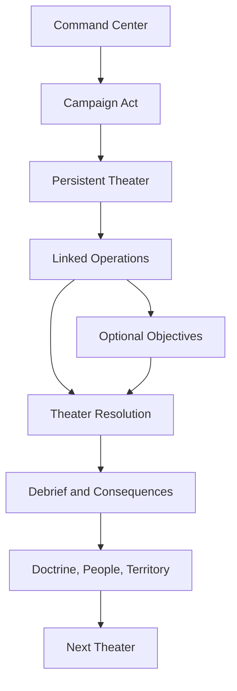

# Shadow Snake: Command Rex — game and campaign storyboard

## Active development canon and later release track

**The active game-development story is deliberately a close, private Metal Gear-adjacent alternate continuity.** It is the version used by the current prototype and by all near-term narrative work. Do not dilute it into an unrelated setting while the team is still discovering the game.

- **Player character:** **Eli**, field identity **Shadow Snake**. He is the boy known to the program as its failed or inferior heir; the game is about him refusing that verdict, not proving it true.
- **Brother and co-lead:** **David**, field identity **Rotten Snake**. He is Eli’s sworn clone-ward brother: raised, tested, and escaped beside him, but **not** the canon David / Solid Snake and not a fourth Les Enfants Terribles clone. Their affection is real before their strategies become incompatible.
- **Canonical brothers at the edge of the story:** David / Solid Snake and George Sears / Solidus Snake remain the three-clone record’s future figures. They may be glimpsed only through sealed records, distant operations, or time-appropriate encounters; they are never reassigned to David / Rotten Snake.
- **Inherited father:** **Big Boss**, absent in person but present in the stories, genes, institutions, and soldier-nations built in his name.
- **Controlling architecture:** **Cipher / the Patriots**, treated as a human system of custodians, secrets, and self-preserving incentives—not as a magic computer that absolves people of responsibility.
- **Mobile home:** the player’s evolving offshore and land-based command is a **free-haven** ideal: a place for soldiers and displaced people to live without being owned by a state. It must not take the name **Outer Heaven**; in the core chronology, that fortified state belongs to the 1995 incident.
- **Prototype siege frame:** **BASILISK REX**, a black-program Metal Gear derivative whose command, power, repair, and deterrence dependencies make it an RTS encounter rather than a cutscene monster.

This is a **fan-development continuity**, not a claim to be lost official canon or a reconstruction of an omitted episode. It starts from recognisable franchise foundations, makes its own explicit departures, and leaves a separate release-adaptation track parked until the game is ready to be shared broadly. Current work may use the names above in internal documents and the private prototype; it must still use original visual design, art, music, dialogue, UI, and maps. Do not treat noncommercial intent as a release plan.

### Continuity contract

The story begins in **1987**, after Eli’s 1984 escape with Tretij Rebenok and the loss of Sahelanthropus, and closes in **1990**, before Eli’s later SAS-era path and before the 1995 Outer Heaven Uprising. It treats the missing years as a tightly bounded fan-continuity playground—not as an assertion that it restores a canon ending.

| Grounded franchise foundation | Command Rex development-continuity decision |
|---|---|
| Les Enfants Terribles produced David / Solid Snake, Eli / Liquid Snake, and later George / Solidus Snake from Big Boss’s DNA. | The three-clone record remains intact. **David / Rotten Snake is a separate, uncredited ward subject from the program’s wider human experimentation**, called Eli’s brother because they chose and protected one another. He is neither Solid Snake nor a secret fourth clone. |
| Eli leaves the MGSV period with Tretij and a weaponized legacy. | The escape fails to create a lasting kingdom. Eli must decide what to do with the people, children, technology, and resentment left in its wake rather than simply repeat the escape fantasy. |
| Cipher and Big Boss turn The Boss’s will into incompatible political projects. | The campaign focuses on the young people and survivors made to inherit that argument—Eli, Rotten Snake, veterans, and civilians—not on declaring one founder correct. |
| “Solid Snake,” “Liquid Snake,” and “Solidus Snake” carry loaded roles. | Eli chooses **Shadow Snake** for this hidden period. His ward brother chooses **Rotten Snake**, an insult reclaimed as a warning against the system that discarded people. The canonical Solid and Solidus names stay attached to their canonical bearers. |
| Later games establish major future events. | The 1995 Outer Heaven Uprising, Zanzibar Land, Shadow Moses, and all later canonical outcomes are **hard stop-lines**. This campaign neither creates their causes anew nor replaces their protagonists. |

### Canon preservation ledger

This is the working rule for the close-development branch. It lets the spin-off feel like it belongs in the series without claiming that every fan theory or unused asset is official history.

| Time / material | Treat as fixed | Command Rex may add | Command Rex must not do |
|---|---|---|---|
| **1964–1984** | The Boss’s legacy, the Patriots/Cipher split, Les Enfants Terribles, MSF/Diamond Dogs, and Eli’s 1984 escape with Tretij are inherited context. | Incomplete ward records, survivor routes, black-budget follow-ons, and conflicting source testimony. | Rewrite the outcome of MGS V, resurrect dead figures, or claim Episode 51’s unfinished material is recovered canon. |
| **1987–1990 — playable period** | Canonical David/Solid, Eli/Liquid, and George/Solidus remain distinct names and future identities. Grey Fox, EVA, Kaz, Ocelot, Dr. Clark, Sigint, Big Boss, and Madnar are living era-appropriate figures. | Shadow Snake, Rotten Snake, Hana, the free-haven crisis, BASILISK, and the program’s unnamed ward survivors. | Make David / Rotten Snake the canonical Solid Snake; make George a mature head of state; put adult Otacon or adult Drebin on the field; call Eli’s haven Outer Heaven. |
| **1990–1994 — coda only** | Eli’s later known path and the approach to the Outer Heaven incident must remain possible. | A protected exit, erased personnel files, and the moral cost that continues after the credits. | Turn the coda into a replacement for Eli’s later history, or resolve characters in ways that block their canonical appearances. |
| **1995 onward — hard stop-line** | Outer Heaven, Zanzibar Land, Shadow Moses, the Patriots crises, and later series outcomes belong to their respective stories. | Dated archive annotations and optional historical context only. | Play, repair, preempt, or contradict those incidents. |

**Fan-lore discipline:** label source confidence in the Archive: **recorded canon**, **unused draft material**, **character testimony**, **fan interpretation**, or **Command Rex addition**. The parasite outcome, the exact missing Kingdom of the Flies ending, and the unseen years after Eli’s escape remain deliberately unresolved; the game can explore their pressure without declaring any theory true.

### Release adaptation track — parked, not active work

The original public-facing Command Rex setting (Rex Ardent, Vale Veyr, the Grey Ark, the Ledger, and Marshal Oris) remains a **future adaptation reserve**, not current canon and not a prerequisite for gameplay or Theater 2. When a public-release decision is made, create a save-safe adaptation branch and review the full public package; do not silently rename the prototype or erase the close-development story in the meantime.

## North star

**Command & Conquer and Metal Gear had a child:** a readable real-time strategy game where the player builds and protects a forward operating base, commands squads at scale, and can dismantle enemy systems through reconnaissance, stealth, deception, recovery, or open combined-arms warfare.

The game earns long-term play because plans have visible consequences, veterans become personally valuable, maps keep opening, and each resolved operation changes the next problem. It must not rely on artificial scarcity, daily chores, paid power, manipulative streaks, or endless notification pressure.

### Player fantasy

The player is neither one invincible infiltrator nor an anonymous army. The player is Eli / Shadow Snake: a commander who can lead a decisive field action while also keeping an entire fragile community alive.

- establish a soldier refuge before it becomes an army;
- build an intelligence picture before committing forces;
- split mixed squads into infiltration, assault, recovery, and support elements;
- decide when deterrence becomes domination;
- learn whether Rotten Snake is ally, rival, manipulated survivor, or the first author of the war Eli is fighting;
- decide whether Shadow Snake’s refuge can stay free enough to disband, rather than becoming the next armed myth.

## Dramatic DNA and mechanical proof

The campaign uses the franchise’s questions directly in its private development canon, but answers them through new RTS theaters and player consequences rather than a sequence of copied scenes.

| Dramatic pressure | Command Rex translation | Mechanical proof |
|---|---|---|
| A person is assigned an identity before they can choose one. | Eli is called the inferior clone; David is branded a discarded, “rotten” test subject. Neither label is a fact about their worth. | Clone records can be recovered, falsified, protected, or exposed; no dossier simply declares the truth. |
| Institutions decide which information survives. | Cipher’s files, covert histories, and official denials make counterevidence look forged, isolated, or dangerous. | Captured archives change routes, enemy orders, civilian trust, and later briefings. |
| War can become an economy and a home. | Shadow Snake needs supplies and protection—but can refuse to turn the free haven into a permanent mercenary engine. | Supply, staffing, and defensive choices change the refuge’s condition, not a morality bar. |
| Deterrence promises safety while normalizing catastrophe. | Metal Gear frames and retaliation networks can deter attacks but make everyone plan around escalation. | Superweapons, autonomous counterstrikes, and public threats create practical benefits and downstream costs. |
| A soldier’s loyalty can conflict with the state’s version of history. | Every theater asks who gets protected, who gets recruited, and whose past gets published. | Nonlethal recovery, evacuation, destruction, and propaganda all alter encounter composition. |
| Peace is an active construction, not the absence of a final boss. | The finale is a collective systems problem, not simply the largest target. | The best outcomes require dismantling incentives, protecting people, and accepting limits on command power. |

### The thematic ladder

Each act owns one question. The campaign repeats the question at tactical scale, base scale, and political scale so the writing is carried by play.

1. **Body — “Who gets to name me?”** Eli refuses the project’s verdict on his blood.
2. **Brother — “Can love survive the role assigned to us?”** Rotten Snake and Eli discover that their connection has been exploited from the beginning.
3. **Place — “Who owns the ground we protect?”** A refuge becomes a political actor without stealing a future nation’s name.
4. **Intention — “What does power mean when no one can see it?”** Eli and Rotten Snake attempt incompatible ways to escape Cipher’s ownership of soldiers.
5. **Peace — “What must a military power give up to make war unnecessary?”** The player dismantles the conditions that make permanent command seem necessary.

## World bible

### The setting: 1987–1990, the war before Outer Heaven

The Cold War did not end cleanly; it became a marketplace. Cipher’s need for stability and Big Boss’s dream of a soldier’s home have both been exported into proxy armies, laboratories, shell governments, and weapons programs. Every faction claims it is preventing a greater catastrophe. Every faction needs people who can be placed in a file, a uniform, or a grave.

Eli’s escape did not free him from this world. It scattered a child-soldier column, a frightened psychic survivor, stolen research, and the myth that one engineered soldier could make a nation by force. **Shadow Command** starts as whatever remains after that failure: a mobile refuge, repair crews, defectors, former child soldiers, and people who do not want to be drafted into anyone’s legend. It may become a defensible free haven, disperse into protected routes, or harden into a warning; it never claims the later name **Outer Heaven**.

Cipher is powerful because its human agents manage information, logistics, identities, and fear. Zero’s long shadow matters, but no single villain can explain away the choices of the handlers, scientists, contractors, and soldiers who preserve the machine.

### Factions

| Faction | Public claim | Private pressure | Field doctrine |
|---|---|---|---|
| **Shadow Command** | A refuge for soldiers, displaced families, medics, technicians, and rescued children who refuse state ownership. | It needs supplies and protection; its survival can drift toward extraction, recruitment, and militarism. | Adaptive mixed squads, recovery, mobile construction, decoys, civilian logistics. |
| **Cipher Directorate** | Maintains global stability and prevents nuclear catastrophe. | Keeps the world legible by classifying people, hiding programs, and creating controlled emergencies. | Sensors, false orders, drones, identity locks, denial-of-service warfare. |
| **Rotten Snake’s Free Column** | Break Cipher by exposing what it did to the brothers and making denial impossible. | David may believe a spectacular threat is the only language the system understands. | Fast raids, captured hardware, information leaks, spectacular sabotage. |
| **War Economy Houses** | Provide private security, restoration, and trade protection. | Earn more from controlled instability than resolved conflict. | Layered defense, convoy warfare, hired specialists, economic pressure. |
| **Local Assemblies** | Protect a city, corridor, or people without being absorbed. | Their interests conflict; none exists merely to reward the player. | Terrain mastery, militias, hidden routes, regional legitimacy. |
| **The Patriot System** | A necessary invisible order, not a faction. | Human custodians, locked records, and decades of self-preserving doctrine make it political. | Predictive responses, false flags, data erasure, retaliatory command. |

### Character bible

| Character | Dramatic function | What they want | What they hide | Mechanical relationship |
|---|---|---|---|---|
| **Eli / Shadow Snake** | Player commander; the canon clone marked as the inferior heir. | A home where soldiers and children are not owned by their past. | He fears the label is true and has already used fear to hold people together. | Player doctrine, relationships, and theater state define whether Shadow becomes protector, warlord, or myth. |
| **David / Rotten Snake** | Eli’s sworn clone-ward brother, rival, and emotional equal—not Solid Snake. | To force the world to admit what it does to “failed” children and stop assigning their future. | He has repeatedly used Shadow Command operations as inputs to expose Cipher; his love for Eli does not make those choices harmless. | Appears as ally, competing commander, absent signal, or opposition force based on stored facts. |
| **Hana Kovac / Wren** | Shadow Command’s survivor-route leader, field medic, and Eli’s slow-burn love interest. | A refuge with open exits, consent, and care that does not depend on one man’s protection. | She saved people by lying to commanders and will leave if Shadow Command starts owning the people it claims to protect. | Opens medical, evacuation, and civilian-legitimacy routes; relationship trust is earned through accountable conduct, never a dialogue pickup or a combat reward. |
| **George Sears / Solidus Snake** | A sealed canonical counterpart and ominous future political heir, not a present-day adult ruler. | To prove that a clean system can end the chaos created by Cipher and Big Boss. | His file is being prepared as a future answer; his direct role is limited to time-appropriate records and a late, controlled encounter. | Provides archive stakes and late-game counter-intelligence; do not make him president, commander of a nation, or a full co-lead before 1990. |
| **Tretij Rebenok / Mantis** | Eli’s oldest surviving witness and a frightened, unusually perceptive young person. | Safety, consent, and a life not defined by usefulness to adults at war. | His power is being exploited by every side; his view of Eli is affectionate but not blindly loyal. | Opens early-warning, deception, and nonlethal information routes; never a disposable superweapon. |
| **EVA** | Keeper of fragmentary origin records and ethical counterweight. | To expose the project without turning its survivors into evidence again. | She chose what to preserve and whom to tell, leaving painful omissions. | Opens archive, recovery, and medical choices; leaving her behind narrows late-game evidence paths. |
| **Big Boss** | Absent father and contested human history, never a resurrection twist. | In life: discoverable only through contradictory traces and present-day consequences. | His public legend omits the people who made the legend possible. | Archives and old contacts reveal incompatible truths; no single collectible provides perfect truth. |
| **Frank Jaeger / Grey Fox** | The era-appropriate field ally, a senior FOXHOUND operative and living proof that a code name can be earned. | Keep young survivors from becoming state property, even while his loyalty to Big Boss grows more complicated. | He is already being pulled toward the future conflict over Outer Heaven. | Leads rare specialist operations, intelligence exchanges, and a nonlethal mentor route; he must leave the campaign intact for his 1995 mission and later fate. |
| **Kazuhira Miller** | Independent survival and logistics contact; an ally whose help always has a strategic price. | Keep soldiers capable of living after their commanders’ dreams fail them. | His advice protects people but also measures every crisis in endurance, preparedness, and control. | Unlocks resilient base openings, training, and evacuation planning; he is neither Eli’s parent nor a permanent radio voice. |
| **Revolver Ocelot** | Cipher-adjacent pressure and unreliable source. | Advance his own reading of Big Boss’s legacy while ensuring no rival owns the board. | Every useful truth he gives is arranged to make another action seem inevitable. | Enables false-flag, counter-intelligence, and provenance missions; no briefing ever treats him as a trustworthy narrator. |
| **Dr. Clark / Para-Medic and Donald Anderson / Sigint** | The scientific and bureaucratic faces of a system that makes people into classified assets. | Preserve research and information control in the name of stability. | They keep records that make the program look inevitable rather than chosen. | Their archives power identity-lock, biometrics, and disclosure missions; capture, expose, or redaction choices materially change enemy systems. |
| **Dr. Madnar** | A brilliant, compromised engineering contact near the early bipedal-weapons economy. | Complete work without again being consumed by a state or patron. | He does not yet have to be a villain for the player to see where this work leads. | Opens counter-Metal Gear and infrastructure alternatives without pre-writing his later 1995 role. |
| **Hal “Otacon” Emmerich** | A future continuity witness, **not** an 1987 field-support adult. | Not yet applicable in the active years; he is a child linked only to the Emmerich record. | His family file shows how weapon programs pass harm across generations. | Appears only through protected archival traces and an optional post-campaign provenance coda; never deploy him, romanticize his childhood trauma, or put him on the radio. |
| **Drebin** | A future arms-economy witness, **not** the adult gun-launderer of 1987–1990. | Not yet applicable in the active years. | His later tradecraft is a cautionary echo of the weapons markets being built now. | Use only as a dated weapons-provenance coda or distant family/trade trace; do not place adult Drebin 893 in an era he cannot plausibly inhabit. |
| **Zero / Cipher Custodians** | Human face(s) of the control architecture. | To preserve a system they believe prevents mass slaughter. | They know stability projections and histories have been edited to perpetuate the system. | Negotiable antagonists who can become witnesses, casualties, or final-system collaborators. |
| **ORBIT-893** | Shadow Command’s original field-support network and dryly practical witness. | Keep people alive through a system that was never meant to care for them. | Its logs can be altered; it must earn the player’s trust through evidence. | Provides tactical legibility, archive provenance, and optional self-correcting intelligence paths. |

### Relationship rules

- Eli and Rotten Snake begin with real tenderness: a shared phrase, a remembered kindness, and a past rescue that cost them both. Do not telegraph David as a cartoon traitor.
- Rotten Snake is wrong about some methods and right about some diagnoses. Eli must be able to learn from him without endorsing his worst choices.
- Hana and Eli begin as peers protecting the same people—not as instant attraction. The 1987–89 chapters establish trust and boundaries; their relationship may begin only in the 1990 chapter, when Eli is an adult, and it can survive only if Eli honors Hana’s authority, consent rules, and right to leave.
- Hana never becomes a hostage, an unlock, a jealousy lever for David, or a reason that Eli “settles down.” Her independent evacuation network must still make decisions the player cannot overrule.
- Tretij is a person with vetoes, friends, fear, and a future. Never make a child, a survivor, or a disability into a convenient magic key.
- Big Boss is not secretly alive in a robot body. The more interesting question is whether institutions can make an absent father govern forever through stories and systems.
- Cipher is a toolset with human custodians, ideological bias, and institutional incentives—not an all-purpose evil computer that explains away human responsibility.

### Era-specific support deployment

Use known characters because their presence changes the human texture of the era—not simply to fill a codec roster. The player’s regular operational support is Hana, Grey Fox, EVA, Kaz, Tretij, and ORBIT; every other return has a defined ceiling.

| Character group | 1987–1990 use | Continuity ceiling |
|---|---|---|
| **Frank Jaeger / Grey Fox** | Direct specialist contact, temporary co-command, survivor-extraction mentor, and moral counterweight to Eli’s growing base. | He remains a FOXHOUND asset heading toward the 1995 disappearance; no cyborg, death, or final break with the canonical Solid Snake occurs here. |
| **EVA, Kaz, Ocelot, Dr. Clark, Sigint, Madnar** | Adults who can give information, training, pressure, engineering alternatives, or institutional opposition. | Each appearance must preserve their later affiliations and unknown gaps; no single character gets to reveal an omniscient “true history.” |
| **Tretij Rebenok** | A survivor with agency, optional scouting/deception routes, and an earned choice to leave the adults’ war. | Do not state a final parasite outcome or make him a permanently healed teammate; the campaign’s account ends before his later known role. |
| **Hal “Otacon” and Drebin** | Archive/coda material only: a dated family-program trace and arms-market provenance, respectively. | They are not adult operational support in this period. No radio portrait, deployable kit, or faux meeting scene. |
| **Naomi, Meryl, Mei Ling, Sniper Wolf, Raiden, Rose, and other future-era figures** | At most a non-exploitative, date-stamped background record when genuinely useful. | Never write adult competencies, romances, or combat roles backward into the 1987–1990 story. |

## Continuous campaign structure

### Command Center

The main menu is an in-world command hub, not a disposable title screen:

- **Continue:** resume the active persistent theater.
- **Campaign:** inspect acts, theaters, objectives, discovered records, and changed routes.
- **Doctrine:** choose earned strategic options rather than raw grind.
- **Ark:** inspect named people, injuries, workload, memorials, supplies, and the living consequences of command.
- **Archive:** compare discovered records, source reliability, and deliberate omissions. It must never pretend to provide one omniscient answer.
- **Settings:** readability, touch controls, audio, effects, difficulty, and accessibility.

### Scale rules

- A **theater** lasts four to seven linked operations. FOBs, captured infrastructure, survivors, research choices, and casualties persist until resolution.
- An **operation** opens a new sector or changes the tactical state of an existing sector. It ends only in an explicit victory, an explicit defeat, or an intentional save/pause.
- A **theater antagonist** is a strategic encounter. Its battlefield capability must be connected to infrastructure the player can disrupt, people the player can recover, information the player can prove, and tactical posture the player has chosen.
- Revisit missions show the state the player created. They are not reset versions of the same map unless the story explicitly explains an occupation, reconstruction, or new disaster.

## Repeatable theater rhythm

1. **Brief:** learn the concrete strategic problem and choose an insertion doctrine.
2. **Recon:** reveal routes, patrols, communications, resources, civilian conditions, and optional targets.
3. **Establish:** capture or negotiate for the first logistics point and deploy a viable FOB network.
4. **Expand:** secure income, power, production, field hospitals, and forward positions.
5. **Disrupt:** hack, expose, reroute, capture, or destroy security, reinforcement, propaganda, and weapons systems.
6. **Endure:** defend against an opponent that reacts to the player’s exposed economy and doctrine.
7. **Decide:** choose lethal/nonlethal, destroy/capture, rescue/abandon, reveal/conceal, or speed/preparation tradeoffs.
8. **Confront:** fight, negotiate with, or outmaneuver the theater antagonist using the state created by prior operations.
9. **Debrief:** carry veterans, casualties, recruits, intelligence, doctrine, and material consequences forward.

**Build 1.9 implementation:** the common Recon → Infiltrate → Assault path is now a field launch system rather than advice copy. Each phase discovers the surviving role-matched assets, assigns the correct default posture, and arms a clear destination/target order. The player may still ignore, reorder, repeat, or mix phases; this is plan acceleration, not a prescribed solution.

## Mission grammar

Every theater should remix a controlled set of mission types rather than inventing a different game each time.

**Build 1.8 implementation:** all 59 operations now resolve through a shared mechanical operation doctrine. Recon changes detection pressure, sabotage changes hacking, convoy changes physical logistics yield, defense changes raid cadence/contracts, reconstruction changes sustain, disclosure changes capture/network pressure, and finales select hunt versus Metal Gear-class siege by declared boss scale. Bespoke maps may add authored interactions, but they must extend this grammar without forking terminal-state authority.

| Mission type | RTS pressure | Espionage solution | Persistent consequence |
|---|---|---|---|
| Foothold | Establish production under threat | Quietly secure logistics before alarms | Starting territory and income |
| Extraction | Hold routes and transport a target | Recover without waking the network | Specialist, evidence, or future ally |
| Sabotage | Break defended infrastructure | Infiltrate, plant, spoof, or hack | Weakens raids or antagonist systems |
| Convoy | Escort or intercept moving assets | Reroute, ambush, steal, or shadow | Resources, contracts, and faction trust |
| Defense | Protect the FOB or liberated area | Mislead attackers and cut command links | Veteran survival and civilian confidence |
| Uprising | Support local forces across a region | Recruit and coordinate cells | Changes who controls the theater |
| Hunt | Find a mobile commander or weapon | Read patterns and recover personnel | Antagonist intel and alternate outcomes |
| Siege | Crack a layered fortress | Disable layers in any order | Determines final-battle difficulty |
| Reconstruction | Keep utilities, people, and routes alive after battle | Reveal who is sabotaging recovery | Determines whether protection becomes occupation |
| Disclosure | Make a contested record credible under active opposition | Preserve sources, protect witnesses, seed counter-narratives | Changes the next act’s legitimacy and enemy playbook |

## Story state: facts, not a morality meter

Do not score the player as “good” or “evil.” The game stores what actually happened, who paid for it, and what it made possible.

| Record | Examples | Later effect |
|---|---|---|
| **People** | named personnel recovered, civilian casualties, captives accepted, specialist deaths, refuge fatigue | staffing, testimonies, unit availability, dialogue, strikes, defections |
| **Place** | utilities repaired, homes razed, territory held, evacuation corridors opened | map condition, regional trust, future base locations, defensive help |
| **Evidence** | source chain preserved, archive released, data altered, witnesses protected | briefing reliability, enemy misinformation, legal/political routes |
| **Arms** | deterrent technologies dismantled, hidden, seized, or fielded | raid doctrine, escalation, finale options, regional fear |
| **Bond** | promises to Rotten Snake kept or broken, honest exchanges, traps tolerated, people harmed by his plans | whether confrontation permits understanding, joint action, or only opposition |
| **Authority** | contracts accepted, House favors owed, Assembly mandates respected, Cipher tools retained | whether the free haven survives as a voluntary network or an armed hierarchy |

### Consequence standards

- A nonlethal route cannot be a free stealth bonus. Prisoners need care, can be wrong, and may create risk as well as opportunity.
- A destructive route cannot be a mere “bad ending” flag. It may be the least harmful immediate option, but infrastructure and bereaved people persist.
- Publishing evidence can protect people or expose them. The player chooses redaction, witnesses, and distribution rather than pressing “truth.”
- Captured enemy technology has labor, power, maintenance, and political costs. It is never a pure upgrade.
- Every operation offers at least one consequence that affects gameplay in the same theater and one that can echo later.

## Campaign plan — 13 theaters / approximately 59 operations

The target is a **45–65 hour first campaign** at a normal pace, with 65–90 hours for thorough recovery, alternate doctrines, and revisits. That is a production target, not permission to begin building all maps at once. Each theater must earn its existence through a distinct strategic problem, story decision, and reusable system expansion.

### Prologue — The Unwanted Son (1987)

Eli intercepts a command imprint in the Barents exclusion zone. It carries **Rotten Snake’s** authentication, directs Shadow Command to a black-program Metal Gear test, and turns every sensible response into data for Cipher. David appears to save Eli remotely, but the recovered trail shows that somebody selected the entire test around the brothers’ bond.

**Question:** Can Eli build anything without first proving the program wrong?

| Theater | Operations | Tactical identity | Central decision | End state |
|---|---:|---|---|---|
| **Sable Crown** | 4 | Snowbound persistent island; first FOB, relay network, stealth lanes, counter-raids. | Prioritize recovery crews, logistics, or intercepted data before the final approach. | BASILISK REX is defeated or disabled; Rotten Snake’s beacon points to the surviving remnants of Eli’s failed kingdom. |

#### Sable Crown operation card

| Operation | Objective and teaching goal | Narrative turn | Persistent payoff |
|---|---|---|---|
| **Foothold** | Secure the first supply node, establish power, build the first perimeter, and make a quiet reconnaissance pass. | Eli learns the test was waiting for a specific clone signature. | First captured territory; baseline Shadow Command survival state. |
| **Ghost Line** | Separate a stealth element, disrupt radar, inspect a patrol pattern, and optionally extract a stranded technician. | The beacon contains a private memory from the clone ward: David choosing not to leave Eli behind. | Radar blind spot or recovered specialist changes Operations 3–4. |
| **Black Relay** | Choose the order of relay severance, response-hangar disruption, logistics capture, and rescue. | The same Cipher network issued contradictory orders to both sides. | Each intact system strengthens BASILISK; each saved person changes post-boss evidence. |
| **Crown Fall** | Solve BASILISK’s power, targeting, repair, and reinforcement dependencies before confronting the chassis. | Rotten Snake reaches Eli live: “Come alone.” ORBIT finds the trap geometry hidden under the signal. | Explicit theater victory; a durable question rather than an answer. |

**Implementation note:** 1.0.1 already supports this operation card. Eli, David / Rotten Snake, Shadow Snake, and BASILISK REX are the active development names; preserve the validated progression graph while growing narrative content around it.

### Act I — Kingdom of Flies (1987)

Eli follows Rotten Snake’s coordinates through the aftermath of the island dream. The campaign never presents an omitted episode as an official missing ending. Instead, it treats the unused Episode 51 material as a disputed fan-text and asks what happens after a young commander’s attempt at a sovereign refuge collapses: where the children go, who sells the weapons, and whether a sanctuary can be made without becoming a recruitment machine.

**Question:** Is a country of soldiers liberation if its children cannot leave it?

| Theater | Operations | Tactical identity | Central decision | Story advancement |
|---|---:|---|---|---|
| **Harrow Spine** | 5 | Wind-cut relay mountains, vertical transit, long sightlines, weather concealment, and signal capture. | Publish a Cipher proof that exposes a refugee route, or delay it to move people safely. | Tretij is found alive; he confirms Rotten Snake has been trying to reach Eli through compromised channels. |
| **St. Heliot Freeport** | 4 | Flooded arms market, movable sea walls, convoy war, civilian power grid, and black-market production. | Break the arms monopoly violently, buy time through a contract, or organize the stranded workers. | Shadow Command becomes public and must declare whether it is a rescue force, army, or state. |
| **The Kingdom That Failed** | 5 | Tropical wreckage, shipyard base building, hidden child routes, surviving Sahelanthropus data, and a siege evacuation. | Dismantle the old command chain, preserve it for deterrence, or hand authority to the people trapped under it. | Eli learns his original “kingdom” was supplied and monitored as a Cipher experiment; the surviving children choose whether to join, leave, or testify. |

### Act II — Brother Signal (1988)

Rotten Snake stops being a disembodied rescue promise. He is operating inside Cipher’s shadow infrastructure under the designation **Rotten Snake**, leaving routes that only Eli can read. Their reunion gives the player the first dual-commander operations, then reveals the cost: David used the Sable Crown test to get Eli moving before Cipher could bury him forever.

**Question:** Can Eli and David choose one another before either chooses a cause?

| Theater | Operations | Tactical identity | Central decision | Story advancement |
|---|---:|---|---|---|
| **Black Vault** | 5 | Buried clone archive, power-starved subterranean warfare, identity-locked doors, and stealth extraction. | Recover all subject files, erase them, or preserve a redacted chain of custody. | EVA’s records establish that the brothers were kept deliberately close enough to bond, then taught mutually incompatible stories. |
| **Vostok Wound** | 5 | Frozen rail corridor, moving build radius, armored pursuit, prisoner rescue, and bridge demolition. | Save David’s embedded contacts, prioritize civilian evacuation, or secure the train carrying the genetic ledger. | Eli and David reunite in person; David admits his manipulation and gives Eli the first real chance to reject him. |
| **Caspian Wake** | 5 | Offshore modular base, naval logistics, amphibious assaults, convoy interdiction, and construction under fire. | Build a permanent refuge, remain mobile, or bargain for a legal charter that can be revoked. | Shadow Command adopts a charter, stays mobile, or disbands into protected routes. It cannot adopt the later name **Outer Heaven**. |

### Act III — A Nation of Soldiers (1989)

The free haven’s promise attracts veterans, defectors, medics, and people who need a home. It also attracts contractors, warlords, and children looking for protection. Rotten Snake argues that neutrality is only a softer form of abandonment; Eli sees every emergency contract turning the refuge into the thing that made them. A sealed record of George / **Solidus Snake** shows the system preparing a future political answer—without turning a teenager into the era’s president.

**Question:** Can a refuge built by soldiers stop needing soldiers to justify itself?

| Theater | Operations | Tactical identity | Central decision | Story advancement |
|---|---:|---|---|---|
| **Contract Coast** | 5 | Merchant-city defense, layered power grids, labor strikes, urban rooftop routes, and multi-front raids. | Protect every district, privilege free-haven supporters, or seize the port authority to stop an imminent massacre. | The player sees how food, maintenance, and representation—not speeches—determine whether the refuge is real. |
| **Zanzibar Corridor** | 4 | Desert rail war, long supply lines, heat visibility, salvage economy, and tank-countertank maneuver. | Accept a strategic mineral concession, leave it to local assemblies, or destroy it so no state can own it. | George’s agents frame Eli as another warlord while offering civilians a stable, managed alternative. |
| **The Perfect Son** | 5 | White-room military campus, biometric deception, mirrored base layouts, squad-versus-squad command, and nonlethal capture routes. | Expose the program preserving George’s future, recruit its coerced officers, or destroy it before the evidence can be used against survivors. | The record claims Eli and Rotten Snake are proof that freedom produces chaos. Rotten Snake nearly accepts the premise; Eli’s reaction becomes a durable Bond fact. |

### Act IV — The Inheritance War (1990)

Cipher makes its last useful offer: legal recognition, supplies, and a place in the system if Eli accepts a controllable command role. Rotten Snake proposes the opposite: make the free haven so dangerous that Cipher cannot erase it. George’s future record offers order without either brother’s grief. All use the same inherited myth; the player must decide what actual people deserve from it.

**Question:** What remains of a free haven when the father’s myth, the brothers’ love, and the weapon all demand a different future?

| Theater | Operations | Tactical identity | Central decision | Story advancement |
|---|---:|---|---|---|
| **Fox Line** | 4 | Contested border network, simultaneous threats, disguised patrols, comms sabotage, and temporary shared control with Rotten Snake. | Honor a truce, defeat Rotten Snake conventionally, or use the truce to isolate Cipher’s custodians. | David and Eli finally fight together on the same field; their private argument can no longer be postponed. |
| **Father’s Grave** | 4 | Abandoned Big Boss facilities, legacy equipment, shifting archives, underground base warfare, and false command recordings. | Publish the whole archive, protect surviving subjects through redaction, or let Cipher retain a sealed truth to prevent immediate retaliation. | The brothers learn that Big Boss opposed being turned into a template, but could not stop institutions from doing it in his name. The fact changes nothing unless they do. |
| **No Man’s Haven** | 4 | A previously altered multi-region endgame: interdependent logistics, counter-Metal Gear operations, civilian evacuation, and simultaneous regional defense. | Disperse power, centralize it under Eli, or join Rotten Snake in a fear-based deterrence gamble. | The final BASILISK network can be dismantled, captured, or used. The player leaves a living political structure, not simply a defeated villain. |

#### Endgame operation card — No Man’s Haven

| Operation | Strategic problem | What the player must solve |
|---|---|---|
| **Common Signal** | A Cipher withdrawal and scattered sabotage will strand real people. | Build temporary, accountable regional logistics before cutting the command core. |
| **The Empty Throne** | Cipher, Rotten Snake, and George’s future record each invite Eli to become the necessary commander. | Defend assemblies, witnesses, and noncombatants while refusing to make one commander the answer. |
| **BASILISK FALL** | A retaliatory Metal Gear network can launch if its custodians lose control. | Disable, evacuate, expose its command chain, or use it at a lasting human cost. |
| **After the Order** | No final enemy remains to unify the refuge. | Establish a charter, disperse power, preserve memorials, and show the continuing work after “victory.” |

### Revelation schedule and brother arc

The campaign must not make every archive collectible tell the same story. Each act answers one question, creates a harder one, and changes a practical mission condition. A player who skips optional material still understands the human stakes; a player who pursues it sees how the institutions have authored competing versions of the brothers.

| Phase | What the player can know | What is still deliberately uncertain | Mechanical consequence |
|---|---|---|---|
| **Prologue · 1987** | Rotten Snake is alive, knows Eli’s private ward memory, and shaped the BASILISK test. Cipher wanted Shadow Command to survive long enough to reveal its doctrine. | Whether David was protecting Eli, using him, or both. | The chosen Sable Crown reward becomes the first durable form of Shadow Command: people, material, or intelligence. |
| **Kingdom of Flies · 1987** | Eli’s failed refuge was provisioned, watched, and politically useful to Cipher. Tretij is alive but has no reason to trust adults with another “home.” | Which actions in 1984 were Eli’s free choices and which were engineered into his available options. | Rescued children, routes, and Sahelanthropus records alter scouting, recruitment, and final deterrence options. |
| **Brother Signal · 1988** | David operates as Rotten Snake inside a Cipher operation and risks people to keep a route to Eli open. EVA confirms that the ward was engineered to make the boys depend on each other, then interpret that dependence differently. | Whether their brotherhood was manufactured or whether the feeling is real because they chose it. | David’s trust state unlocks shared-command operations, rescue routes, and different enemy countermeasures; it never grants a free win. |
| **A Nation of Soldiers · 1989** | A George / Solidus file is being prepared as the “stable” public solution. Free-haven food, labor, consent, and legal structure matter more than its flag. | Whether a soldier refuge can remain voluntary once it becomes strategically important. | Authority facts change production capacity, strike/defection risk, local defense, and which factions can speak credibly for the player. |
| **Inheritance War · 1990** | Big Boss rejected becoming a template, yet his image and old structures still fuel every side. Cipher’s custodians are people maintaining a system, not a final computer to shoot. | Whether Eli and David can act freely without creating a new version of their father’s legend. | The finale reads Bond, People, Authority, Arms, and Evidence facts—not a dialogue wheel—to determine available plans and outcomes. |

### Character destinations the player earns

These are arc destinations, not fixed “good” or “evil” labels. No route lets a character’s blood, diagnosis, past trauma, or code name declare their value.

| Character | Protective route | Compromised route | Required emotional truth |
|---|---|---|---|
| **Eli / Shadow Snake** | Builds a refuge that can outlive his command and lets people leave it. | Uses fear, centralization, or BASILISK deterrence to make himself indispensable. | Eli is not saved by proving he has superior genes; he is saved only by what he chooses to build and relinquish. |
| **David / Rotten Snake** | Helps expose Cipher while accepting that people are not pieces in a plan, even his brother. | Makes Eli’s survival and public spectacle instruments of a necessary war. | David’s affection is genuine, which makes his manipulation a tragedy instead of a twist. |
| **Hana Kovac / Wren** | Keeps the survivor routes independent and chooses partnership with Eli only when he proves she and the people are never his property. | Leaves, or is forced to lead opposition evacuation, when Shadow Command becomes another ownership system. | Love must make both characters freer and more truthful; it cannot forgive command abuse or turn her into Eli’s reward. |
| **George / Solidus Snake** | Appears as a human being beyond the project’s immaculate prediction in the limited, time-appropriate late encounter. | Allows the project’s future promise of perfect order to erase people before it even reaches public power. | George is not a monster because he is “perfect”; he is dangerous when certainty gives him permission to own others. |
| **Tretij Rebenok** | Receives safety, consent, friends, and a future outside tactical utility. | Is treated as a sensor, weapon, or shortcut by every faction. | The player cannot purchase absolution by rescuing him once; ongoing autonomy must alter the campaign’s choices. |
| **EVA** | Preserves truth with source context and survivor consent. | Reduces the brothers to evidence in a war over their father. | Careful truth-telling is not weakness, and secrecy is not automatically protection. |

## Endings: outcomes, not color-coded rewards

The ending reads the player’s stored facts. No ending should be labelled “best,” and none should be a surprise punishment for one binary dialogue choice.

| Outcome | Campaign record that enables it | Meaning |
|---|---|---|
| **A Heaven With Open Gates** | Regional assemblies survive, evidence has credible source chains, Tretij remains autonomous, the retaliatory network is dismantled, and command power is dispersed. | Eli helps build a home that no longer needs a Snake to command it. It is fragile, local, and worth protecting. |
| **Guarded Haven** | The free haven has strong people/civilian support, some deterrence remains, and a transparent charter limits command power. | The refuge becomes protective without pretending its military power is harmless. |
| **Shadow Regime** | Eli seizes Cipher tools or strategic weapons, centralizes contracts, and breaks opponents faster than relationships can be repaired. | Conflict drops at first; the ending makes clear that stability has become dependent on Shadow Snake’s unaccountable command. |
| **Ash Brotherhood** | Eli and David retain enough trust to cooperate but resolve the crisis through fear, spectacle, or hidden force. | The brothers survive their inheritance together while preserving the logic that created it. Their affection is real; so is the warning. |
| **Scattered Lights** | Key systems fail, people are saved unevenly, or power fragments before a durable replacement exists. | Not a fail state: local communities carry the work forward without a single heroic center. The final image asks the player to value people over a clean legend. |

## Narrative presentation rules

- **Briefings are concise.** A normal operation gets a 30–60 second readable dossier, contextual field dialogue, and a 60–90 second debrief. Deep lore lives in discovered records for players who want it.
- **No lore dump fixes a contradiction.** If a twist matters, it must recontextualize an objective, map, person, or system the player has already encountered.
- **Use contradiction deliberately.** The Archive shows provenance, missing pages, source motive, and confidence. It never uses “the real truth” as a reward label.
- **Keep humor human.** Strange field tools, overly formal system notices, exhausted logistics banter, and optional environmental stories can puncture tension. Never make civilians, disability, trauma, or ethnic/cultural identity the punchline.
- **Meta effects support accessibility.** A compromised HUD, false map label, or altered briefing can be effective only if it is readable, reversible, and never blocks a required input or save. The player must be told how to restore reliable information.
- **Bosses are characters through systems.** Their personality appears in how they use territory, people, resources, and information—not in a queue of interchangeable gimmick names and monologues.

## Progression without manipulation

### Theater progression

- captured territory and repaired infrastructure;
- persistent base and research state;
- veteran units, named specialists, injuries, and recovery;
- optional-objective advantages and unresolved damage;
- faction trust, civilian conditions, contracts, and Assembly mandates;
- antagonist systems enabled, disabled, exposed, or repurposed.

### Campaign progression

- Doctrine Points from completed theaters and high-value outcomes;
- new formations, command tools, infiltration methods, and support capabilities;
- recovered specialists opening side-grade research branches;
- Ark history, memorials, and earned visual identity;
- an Archive built from information actually discovered in play.

Progression favors **new choices and combinations**. Basic controls, readable information, saves, accessibility, and quality-of-life commands are never unlocks.

## Force and base roster target

The current five-team/four-structure prototype is the nucleus, not the final army. The Prologue introduces a useful vertical slice; Act I grows into the full initial production roster below. Every role needs a readable silhouette, a prerequisite, a counter relationship, and at least one interaction with stealth, information, recovery, or escalation.

| Branch | Act I production roster | Strategic purpose | Tactical-espionage alternative |
|---|---|---|---|
| Line infantry | Viper rifle team, Bastion heavy team, Lancer anti-armor team | Screen, suppress, clear infantry, stop vehicles | Hold fire, use smoke, breach quietly, capture survivors |
| Specialists | Wraith infiltrator, Ghost sniper/observer, Signal Hacker, Combat Engineer, Lifeline medic, Specter scout | Recon, sabotage, repairs, precision, recovery, EW | Tranq, low signature, spoof, jam, extract, interrogate |
| Light vehicles | Weasel recon bike, Mule logistics rover, Jackal IFV | Vision, resupply, transport, anti-infantry mobility | Silent observation, false signatures, personnel extraction |
| Armor | Kodiak battle tank, Mantis missile carrier, Tortoise recovery vehicle | Break defenses, anti-armor/air, recover damaged assets | Disable rather than destroy; tow/capture abandoned technology |
| Air/support | Raven drone, Skua transport rotorcraft, Firefly gunship | Recon, insertion, extraction, fire support | Passive sensor flight, low-altitude insertion, nonlethal overwatch loadout |
| Core base | Forward Command, Micro Reactor, Barracks, Vehicle Fabricator, Helipad | Build radius, power, infantry, vehicles, aircraft | Command encryption and signature-management upgrades |
| Support base | Field Hospital, Repair Bay, Comms Array, R&D Lab, Supply Depot | Recovery, sustain, radar/EW, research, storage/income | Recover personnel, intercept communications, spoof reinforcement routes |
| Defense | Sentry Nest, Sensor Mast, wall, gate, minefield, AA battery, decoy emitter | Layered perimeter and counter coverage | Detection without firing, remote disable, false FOB signature |

Unlock order creates new decisions without making early forces obsolete:

1. **Prologue:** current roster plus Engineer, Ghost, Signal Hacker, Bastion, Raven drone, and one light vehicle; repair bay, hospital, comms array, walls/gates, and vehicle fabrication.
2. **Early Act I:** logistics rover, IFV, tank, R&D lab, depot, AA, minefield, and transport rotorcraft.
3. **Late Act I:** missile carrier, recovery vehicle, gunship, decoy emitter, captured-technology branch, and specialized nonlethal loadouts.

The player should be able to win with combined arms, an intelligence-led precision force, a defense/economy snowball, or a hybrid. No branch should reduce the game to one dominant-unit spam.

## Gameplay gates before Theater 2

**Build 1.3 implementation checkpoint:** the Prologue, all three Act I theaters, and all three Act II theaters now share one deterministic 33-operation campaign graph with sequential unlocks, persistent in-theater forces/bases, explicit checkpoint continuation, explicit victory, and explicit Forward Command defeat/restart. This is a progression-integrity vertical slice, not finished theater production: the current builds temporarily reuse Sable Crown's proven map/objective grammar while Harrow Spine, St. Heliot, The Kingdom That Failed, Black Vault, Vostok Wound, and Caspian Wake receive their distinct terrain, weather, faction doctrine, encounter systems, assets, and balance passes. The graph must remain authoritative as those layers arrive.

Boss scale follows encounter meaning: commanders and conventional command vehicles remain approximately unit-scale; only a declared Metal Gear-class chassis receives an oversized silhouette, and only during a theater's final operation.

### Command fluency

- reliable click selection and deliberate drag-box selection;
- mobile order/pan modes with large touch targets;
- persistent control groups and subgroup filters;
- queued waypoints and synchronized orders;
- formations, spacing, focus fire, retreat, and transport;
- continuous unit destinations; the visible grid governs construction rather than locomotion;
- clear selected-unit and order feedback.

### Tactical terrain and combat

- readable hard cover, concealment, elevation, choke points, and traversal classes;
- line-of-sight and last-known-position feedback;
- destructible and repairable battlefield features;
- weather/time conditions that change detection and mobility;
- armor, penetration, suppression, morale, and target priorities;
- medics, casualty states, recovery, resupply, and field hospitals;
- nonlethal capture as a strategic personnel/economy choice.

### Base warfare and espionage

- build-radius and power-grid clarity;
- captured logistics/intelligence/command points that project their own forward construction grids for satellite bases and defenses;
- multiple production queues and rally routes;
- walls, gates, repair zones, sensors, and layered defense;
- mobile/deployable structures where thematically appropriate;
- raids that scout, probe, sabotage, assault, and siege differently;
- alarms interruptible before full escalation;
- guard communication, search sectors, disguises, decoys, EW, interrogation, and misinformation;
- captured intelligence that changes the tactical map.

## Production sequence

### Build 1.1 — Command fluency

- queued shift/toggle orders and numbered waypoint visualization — implemented, awaiting phone endurance verification;
- wedge, line, column, and loose formation presets with deterministic spacing — implemented;
- explicit focus-fire, FOB fallback, and persistent 12-meter guard-area commands — implemented;
- fixed two-row mobile command cluster plus a dismissible command-deck sheet as the low-friction touch equivalent — implemented, awaiting 390×844 verification;
- NEXT/TAB cycling for stacked friendly units — implemented.

### Build 1.2 — Tactical causality

- mechanical hard cover, concealment, elevation, and hazards with on-map rule labels — implemented across all 13 theater profiles;
- interruptible patrol alarms, communication-link rates, visible last-known search areas, and full-alert consequences — implemented; authored multi-sector search geometry remains;
- recoverable suppression/morale bands plus the first armor/penetration counter matrix — implemented; human-speed tuning remains;
- clearer weapon, unit, terrain, and opponent-doctrine relationships — implemented in the battlefield HUD, raid clock, status badges, field manual, and deterministic tests.

### Build 1.3 — Base warfare and opponent doctrine

- layered power/build networks, repair zones, walls, and gates;
- smarter scout, sabotage, assault, and siege raids;
- multiple production channels and infrastructure targeting;
- tune the Prologue to support at least three viable openings.

**Build 1.8 implementation checkpoint:** Repair Bays now apply and display tested structure/vehicle restoration zones; walls redirect continuous unit movement; powered IFF gates pass friendly units while stopping hostile forces; and sealed defensive lines force a hostile breach target. Deeper multi-grid power dependencies and authored enemy-base networks remain.

**Build 1.9 implementation checkpoint:** captured control points now project a visible 26m build grid and offer contextual Sentry, Sensor, Depot, rally, and full-catalog actions. Units and facilities expose frequent actions beside the selected entity, while the collapsed-by-default deck remains the strategic planning surface. The same phase-asset and role-posture rules drive desktop and touch controls.

### Build 1.4 — Prologue completion gate

- full-length pacing and save/resume validation;
- strategic BASILISK encounter with infrastructure dependencies;
- consequence-aware debrief and campaign rewards;
- first complete usability pass on phone, tablet, and desktop.

### Future release-adaptation gate — parked

- when a broad public-release decision is made, branch the close-development story into a save-safe adapted presentation rather than silently renaming the active prototype;
- preserve validated mission graphs and player-facing mechanics while changing only presentation/data identifiers;
- run a protected-term and visual-reference audit before a public build;
- have qualified IP counsel review the public release package if it will be distributed broadly or monetized.

Only after Builds 1.1–1.4 pass should production begin on Harrow Spine, the first new theater. The release-adaptation gate is not a blocker for private development.

## Research use and adaptation guardrails

The close-development story separates **franchise foundation**, **creator material**, **fan interpretation**, and **our deliberate AU choices**:

- The franchise’s richest questions remain inherited identity, information control, war economies, deterrence, intention, and the work of peace. In the active prototype, those questions may be carried by Eli, David / Rotten Snake, Grey Fox, EVA, Big Boss, Cipher, and the free haven—not by claiming the later Outer Heaven incident.
- The missing Kingdom of the Flies material is a springboard, not a lost episode this game claims to reconstruct. Our Kingdom of Flies begins from its aftermath and makes its own stated 1987 divergences.
- Fan theories are useful only as questions: How does a young antagonist acquire ideology? What does a survivor do after escaping a role? Can a control system be opposed without becoming it? They are not facts to silently canonize.
- A later public release is a different creative and legal task. It must stand on its own expressive story, characters, art, music, terms, and marketing; noncommercial intent is not a release strategy or a legal clearance.
- This is a design and risk-management rule, not legal advice. Use counsel for a public release or any monetization decision.

Research starting points: [Konami’s official series history](https://eu-support.konami.com/hc/en-gb/articles/9822379926423-Backstory-What-is-the-timeline-of-the-events-that-precede-Metal-Gear-Solid-V-Ground-Zeroes-and-Metal-Gear-Solid-V-The-Phantom-Pain), [Konami’s MGS archival history](https://www.konami.com/mg/archive/mg25th/truth/mgs.html), [Konami’s archive sample on the 1972 clone generation](https://www.konami.com/mg/mc/s/media/mc1_sample_mgs_en.pdf), [Konami’s MGS4 archive sample on the Outer Heaven Uprising](https://img.konami.com/mg/mc2/s/img/top/book_sample_mgs4_en.pdf), [the official MGS V nuclear-disarmament conditions](https://www.konami.com/mg/mgs5/tpp/en/news/20151126.html), [reporting on the omitted Episode 51 and its narrative status](https://time.com/4473908/metal-gear-solid-5-ending/), and the [U.S. Copyright Office Fair Use Index](https://www.copyright.gov/fair-use/).
